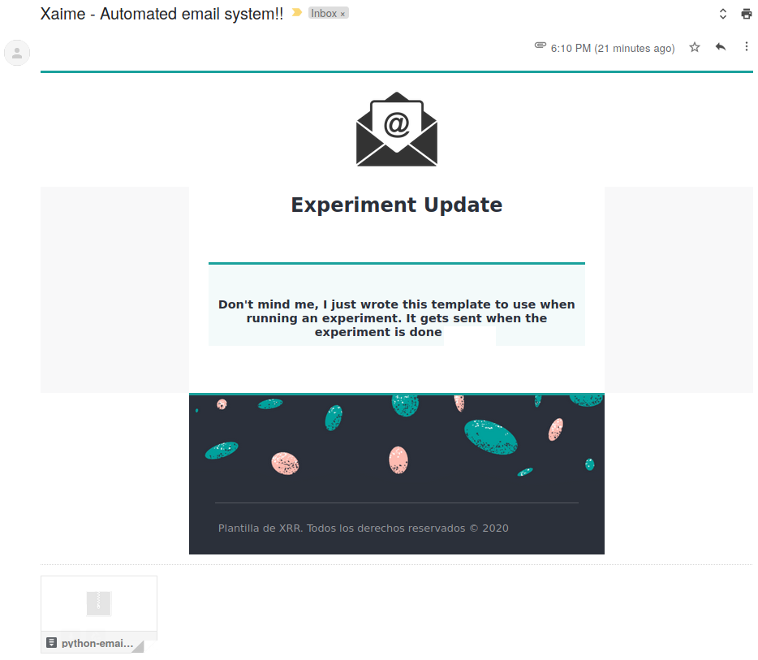

# python-email
This code defines the function `message` to send emails from an specified email account in `libs/info.py`. It also uses the email template specified on 'libs/html_template.py'.

## `html_template.py`
 
This template has two variables:

1. `html_start` - Stores the beginning of template, up to where we want to insert the actual body of the email.
2. `html_end` - Stores everything after the body of the email (footer, signature etc).
 
## `info.py`

This stores two variables:

+ `user` = "example@domain.com" # Email account that we own
+ `psswd` = "XXXXXXXXXXXXX"     

 NOTE: Don't forget to type the actual password when using it  

## `pycoelec.py`

This can be called as:
    
    message(
          recipients=['XXXXXXXX@domain.com'],
          subject='This is the subject',
          text="""This is the body of the email""",
          Files=['file_to_be_attached.extension'] # name if in same folder, full path otherwise 
          )
          
          
## Examples of how it looks

 
 
